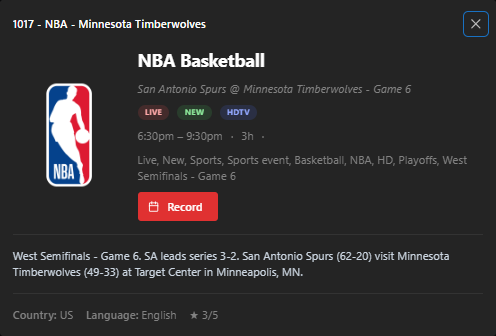
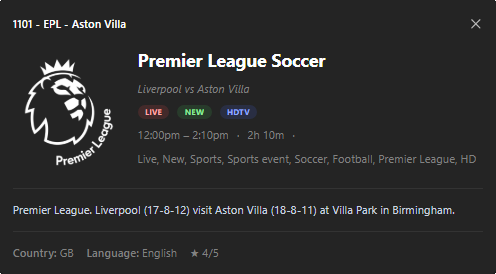

# epgxmltv — Sports EPG Generator

A collection of lightweight C# file-based apps that fetch live sports schedules from ESPN and generate XMLTV Electronic Program Guide (EPG) files. Perfect for integrating game schedules into your IPTV setup, Dispatcharr, Plex, Jellyfin, Emby, or any software that consumes XMLTV data.

These scripts are specifically designed for the dedicated team-channel packages that IPTV providers offer, ensuring your channels always have an accurate and richly detailed program guide.

## Supported Leagues

| League | Script | Output |
| :--- | :--- | :--- |
| NBA | `epgxmltv-nba.cs` | `output/nba.xml` |
| EPL (Premier League) | `epgxmltv-epl.cs` | `output/epl.xml` |

---

## Pre-generated EPGs

If you don't want to run the scripts yourself, EPGs are automatically generated daily and available directly from this repository. Plug these URLs directly into your IPTV player or media server.

### NBA

> **Note:** The NBA season is currently over. Automatic guide updates for this league have been temporarily disabled and will return when the next season starts.

**Compressed (Recommended):**
```text
https://github.com/philipsaad/epgxmltv/raw/refs/heads/main/output/nba.xml.gz
```

**Raw XML:**
```text
https://github.com/philipsaad/epgxmltv/raw/refs/heads/main/output/nba.xml
```

### EPL (Premier League)

**Compressed (Recommended):**
```text
https://github.com/philipsaad/epgxmltv/raw/refs/heads/main/output/epl.xml.gz
```

**Raw XML:**
```text
https://github.com/philipsaad/epgxmltv/raw/refs/heads/main/output/epl.xml
```

---

## Features

### NBA (`epgxmltv-nba.cs`)

- **Rich Metadata:** Automatically generates descriptions including team records, arena info, and matchup stakes.
- **Playoff Awareness:** Smart handling for playoff games, including series game numbers, elimination game detection, and dynamic broadcast lengths.
- **Custom Categorization & Ratings:** Assigns star ratings based on game importance (e.g., Finals get higher ratings) and sets appropriate DVR keywords.
- **Dual Output:** Generates both a raw `.xml` file and a highly compressed `.xml.gz` file simultaneously.

### EPL (`epgxmltv-epl.cs`)

- **Rich Metadata:** Automatically generates descriptions including team records (W-D-L), stadium info, and matchweek labels.
- **Big Six Awareness:** Boosts star ratings for marquee fixtures involving Arsenal, Chelsea, Liverpool, Man City, Man United, and Tottenham.
- **Custom Categorization & Ratings:** Assigns star ratings based on fixture prestige and sets appropriate DVR keywords.
- **Dual Output:** Generates both a raw `.xml` file and a highly compressed `.xml.gz` file simultaneously.

---

## Prerequisites

To run these scripts, you need the .NET 10 SDK (or later).

1. Install the [.NET 10 SDK](https://dotnet.microsoft.com/download/dotnet/10.0).

That's it — no additional tools or global installs required. The scripts run directly via `dotnet run`.

---

## Usage

### NBA

```bash
dotnet run epgxmltv-nba.cs
```

By default, fetches games from today to 14 days in the future and saves to `output/nba.xml` (and `output/nba.xml.gz`).

### EPL

```bash
dotnet run epgxmltv-epl.cs
```

By default, fetches matches from today to 14 days in the future and saves to `output/epl.xml` (and `output/epl.xml.gz`).

### Command Line Options

Both scripts accept the same set of options. Use `--` to separate `dotnet run` arguments from script arguments.

| Option | Description | Default |
| :--- | :--- | :--- |
| `--days-ahead <n>` | Number of days into the future to include | `14` |
| `--days-back <n>` | Number of days in the past to include | `0` |
| `--output <path>` | Output file path for the XMLTV file | *(per-league default)* |
| `--schedule-url <url>`| Override the default schedule URL | *(ESPN Scoreboard API URL)* |

### Examples

**Fetch a full month of upcoming NBA games:**
```bash
dotnet run epgxmltv-nba.cs -- --days-ahead 30 --output ./full-month.xml
```

**Fetch a custom window of EPL matches (3 days back, 7 days forward):**
```bash
dotnet run epgxmltv-epl.cs -- --days-ahead 7 --days-back 3
```

---

## Team Mappings

Each script uses an internal dictionary mapping ESPN team IDs to standard XMLTV Channel IDs. To map games to specific channels in your IPTV m3u playlist, ensure the `tvg-id` in your m3u matches the `ChannelId` in the corresponding script's `AllTeams` dictionary.

**NBA examples:** `NBA-LosAngelesLakers.us`, `NBA-BostonCeltics.us`

**EPL examples:** `EPL-Arsenal.gb`, `EPL-Liverpool.gb`, `EPL-ManchesterCity.gb`

---

## Example Guide Data

Here is an example of what the generated EPG data looks like when rendered in Dispatcharr:



